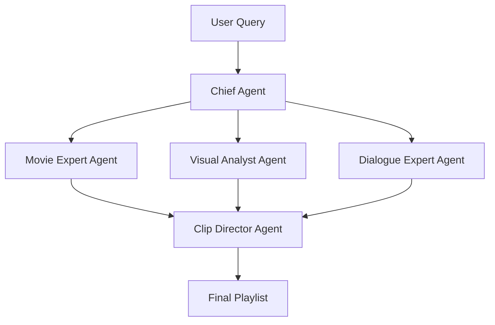

# Sainma Agent Architecture (Using CrewAI)

## Overview
Sainma uses CrewAI to orchestrate a crew of specialized AI agents that work together to provide real-time movie search and clip generation.

## Agent Crew Structure

### 1. Chief Agent (Coordinator)
```python
class ChiefAgent(Agent):
    def __init__(self):
        super().__init__(
            role="Chief Search Coordinator",
            goal="Coordinate search and clip generation process",
            backstory="Expert at understanding user queries and coordinating other agents",
            model=Deepseek,  # 7.14M tokens for complex coordination
            tools=[QueryAnalyzer, TaskDecomposer, AgentCoordinator]
        )
```
- Responsibilities:
  * Query understanding
  * Task decomposition
  * Agent coordination
  * Result compilation

### 2. Movie Expert Agent
```python
class MovieExpertAgent(Agent):
    def __init__(self):
        super().__init__(
            role="Movie Knowledge Expert",
            goal="Provide deep movie knowledge and context",
            backstory="Comprehensive knowledge of movies, characters, and plots",
            model=LlaMA2_13B,  # via Ollama
            tools=[MovieDatabase, CharacterTracker, PlotAnalyzer]
        )
```
- Responsibilities:
  * Movie information
  * Character relationships
  * Plot understanding
  * Scene context

### 3. Visual Analyst Agent
```python
class VisualAnalystAgent(Agent):
    def __init__(self):
        super().__init__(
            role="Visual Scene Analyst",
            goal="Analyze visual content of scenes",
            backstory="Expert at understanding visual elements and scene composition",
            model=LlaMA2_7B,  # via Ollama
            tools=[
                CLIP,  # Scene understanding
                YOLOv8,  # Object detection
                SceneDetector  # Scene boundaries
            ]
        )
```
- Responsibilities:
  * Scene analysis
  * Visual content understanding
  * Character detection
  * Scene boundary detection

### 4. Dialogue Expert Agent
```python
class DialogueExpertAgent(Agent):
    def __init__(self):
        super().__init__(
            role="Dialogue and Audio Analyst",
            goal="Process and understand dialogue and audio",
            backstory="Expert at analyzing conversations and speech",
            model=LlaMA2_7B,  # via Ollama
            tools=[
                Whisper,  # Speech to text
                RoBERTa,  # Sentiment
                DialogueAnalyzer  # Context
            ]
        )
```
- Responsibilities:
  * Subtitle processing
  * Dialogue analysis
  * Speech recognition
  * Conversation context

### 5. Clip Director Agent
```python
class ClipDirectorAgent(Agent):
    def __init__(self):
        super().__init__(
            role="Clip Generation Director",
            goal="Create perfect clips from scenes",
            backstory="Expert at video editing and clip creation",
            model=LlaMA2_7B,  # via Ollama
            tools=[
                ClipGenerator,
                FFmpeg,
                QualityChecker
            ]
        )
```
- Responsibilities:
  * Clip generation
  * Scene stitching
  * Quality control
  * Format optimization

## Crew Workflow

### 1. Task Creation
```python
crew = Crew(
    agents=[
        ChiefAgent(),
        MovieExpertAgent(),
        VisualAnalystAgent(),
        DialogueExpertAgent(),
        ClipDirectorAgent()
    ],
    tasks=[
        Task(
            description="Process user query and generate relevant clips",
            expected_output="Curated playlist of relevant clips"
        )
    ]
)
```

### 2. Process Flow


### 3. Real-Time Coordination
```python
class SainmaCrew:
    def process_query(self, query: str) -> ClipPlaylist:
        # 1. Chief Agent analyzes query
        task_plan = self.chief_agent.analyze_query(query)
        
        # 2. Parallel Processing
        with concurrent.futures.ThreadPoolExecutor() as executor:
            movie_future = executor.submit(self.movie_expert.process, task_plan)
            visual_future = executor.submit(self.visual_analyst.process, task_plan)
            dialogue_future = executor.submit(self.dialogue_expert.process, task_plan)
            
        # 3. Clip Generation
        clips = self.clip_director.generate(
            movie_results=movie_future.result(),
            visual_results=visual_future.result(),
            dialogue_results=dialogue_future.result()
        )
        
        return ClipPlaylist(clips)
```

## Agent Communication
- Uses CrewAI's built-in communication protocols
- Shared memory for context
- Event-based updates
- Parallel processing where possible

## Model Configuration
1. **Deepseek (7.14M tokens)**
   - Used by: Chief Agent
   - Purpose: Main coordination and reasoning

2. **LlaMA 2 (via Ollama)**
   - Used by: Specialist agents
   - Variants:
     * 13B for Movie Expert
     * 7B for other agents

3. **Specialized Models**
   - CLIP: Visual understanding
   - Whisper: Speech recognition
   - YOLOv8: Object detection
   - RoBERTa: Sentiment analysis

## Performance Optimization
1. **Parallel Processing**
   - Concurrent agent execution
   - Task batching
   - Resource pooling

2. **Caching**
   - Result caching
   - Model caching
   - Embedding caching

3. **Resource Management**
   - Dynamic model loading
   - Memory optimization
   - GPU utilization

## Implementation Priority
1. Set up CrewAI infrastructure
2. Implement Chief Agent
3. Add specialist agents
4. Integrate specialized models
5. Optimize performance

This architecture leverages CrewAI's strengths for agent coordination while maintaining our system's real-time requirements.
